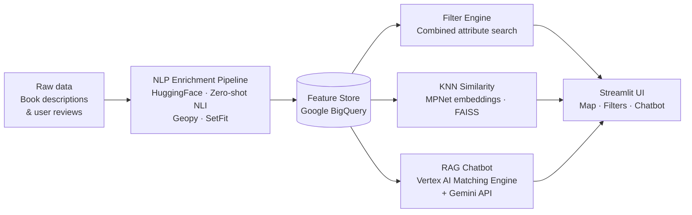

# My Shelves — Book recommendations powered by what a book *feels* like, not just what it's about


---

## The problem with "You might also like…"

Classic recommendation engines sort books by genre, author, or star rating. That tells you *what* a book is — not *how it feels* to read it.

A reader who finished a slow-burning, melancholy novel set in wartime France isn't looking for another "historical fiction 4-star" book. They want the same emotional texture: the grief, the deliberate pacing, the sense of place.

**My Shelves** extracts those qualities automatically — emotions, narrative pace, romantic intensity, geographic setting — and makes them searchable and comparable.

---

## Screenshots

<!-- [screenshot: home page — filter search] -->
<!-- [screenshot: interactive map view] -->
<!-- [screenshot: RAG chatbot — query "Je cherche un livre pendant la seconde guerre mondiale en Italie"] -->

---

## How it works

Raw book descriptions and user reviews are fed through an NLP enrichment pipeline that extracts six semantic attributes missing from standard metadata. Each book ends up with a structured feature vector — a mix of emotion scores, categorical labels, and geocoordinates — stored in BigQuery as a feature store.

Those enriched features power three independent recommendation engines served through a FastAPI backend: a combinable filter search, a KNN similarity engine built on Sentence Transformer embeddings, and a RAG chatbot that accepts free-form natural language queries, retrieves semantically matched results from Vertex AI Matching Engine, and generates answers with Gemini.



---

## NLP enrichment — 6 attributes extracted automatically

| Attribute | What it captures | Method |
|---|---|---|
| **Emotions** | Dominant feelings while reading (joy, sadness, fear, anger…) | HuggingFace sentiment classification |
| **Narrative pace** | How fast the story moves (slow-burn, fast-paced, gripping…) | Zero-shot classification (NLI/BART) |
| **Main themes** | Core topics beyond genre (trauma, redemption, identity…) | Zero-shot multi-label NLI |
| **Character type** | Protagonist archetype (anti-hero, coming-of-age, mentor…) | Zero-shot classification (NLI) |
| **Romantic intensity** | Level of romance in the narrative (none, subplot, central) | Zero-shot classification (NLI) |
| **Geographic setting** | Country / region where the story takes place | Named entity extraction + geocoding (Geopy) |

---

## Key features

- 🗺️ **Interactive world map** — browse books by the country they're set in; click a pin to open the book detail with all enriched attributes
- 🎭 **Emotion & criteria search** — combine filters across any extracted attribute (pace + emotion + page count + geography) to find exactly the reading experience you're after
- 🔍 **"More like this" similarity** — KNN search over MPNet embeddings and enriched features finds books that feel alike, not just books tagged alike
- 🤖 **Natural language chatbot (RAG)** — ask in plain language, e.g. *"Je cherche un livre pendant la seconde guerre mondiale en Italie"*, and get semantically matched results via Vertex AI Matching Engine and Gemini
- 📊 **Fully enriched feature store** — every book carries 6 NLP-derived attributes alongside standard metadata, queryable at any time through the FastAPI backend

---

## Tech stack

| Layer | Tool | Role |
|---|---|---|
| **NLP** | HuggingFace Transformers | Emotion classification, zero-shot NLI |
| **NLP** | Sentence Transformers (MPNet) | Semantic embeddings for KNN & RAG |
| **NLP** | SetFit | Few-shot fine-tuning for classification |
| **NLP** | Geopy + countryinfo | Geographic entity extraction and geocoding |
| **ML** | scikit-learn | KNN pipeline and feature preprocessing |
| **ML** | FAISS | Fast vector similarity search |
| **ML** | TensorFlow / PyTorch | Model inference |
| **RAG** | Vertex AI Matching Engine | Scalable semantic index |
| **RAG** | Gemini API | Answer generation from retrieved context |
| **Backend** | FastAPI + Uvicorn | REST API |
| **Backend** | Pydantic | Request/response validation |
| **Backend** | Prefect | NLP pipeline orchestration |
| **Frontend** | Streamlit | Web interface |
| **Frontend** | Folium + streamlit-folium | Interactive map |
| **Cloud** | Google BigQuery | Feature store and data warehouse |
| **Cloud** | Google Cloud Storage | Embedding and model artifact storage |
| **Cloud** | Cloud Run + Artifact Registry | Containerised API deployment |
| **Data** | Pandas / NumPy | Data processing |

---

## Quickstart

```bash
# 1. Clone the repo
git clone https://github.com/<your-org>/my-shelves.git && cd my-shelves

# 2. Create and activate a virtual environment
python -m venv .venv && source .venv/bin/activate

# 3. Install dependencies
pip install -r requirements.txt && pip install -e .

# 4. Copy the env template and fill in your GCP credentials and API keys
cp .env.example .env

# 5. Run the NLP enrichment pipeline (first time only — writes to BigQuery)
python -m my_shelves.workflow

# 6. Start the FastAPI backend
uvicorn my_shelves.api.api:app --reload --port 8000

# 7. Launch the Streamlit frontend (in a separate terminal)
streamlit run src/app/main.py
```

> **Required env vars:** `GCP_PROJECT`, `BIGQUERY_DATASET`, `GCS_BUCKET`, `VERTEX_INDEX_ENDPOINT`, `GEMINI_API_KEY`

---

## Project structure

```
my-shelves/
├── src/
│   ├── my_shelves/          # Core package
│   │   ├── api/             # FastAPI endpoints + Vertex AI vector search
│   │   ├── ml/              # NLP classification, similarity, chatbot, location
│   │   ├── prepare/         # Data cleaning, processing, training scripts
│   │   ├── utils/           # BigQuery client, dataset helpers, params
│   │   └── workflow.py      # Prefect pipeline orchestration
│   └── app/                 # Streamlit frontend
│       ├── main.py          # App entry point and routing
│       ├── show_features.py # Filter search page
│       ├── similarity_page.py # KNN similarity page
│       ├── show_chatbot.py  # RAG chatbot page
│       └── book_detail.py   # Individual book view
├── notebooks/               # EDA and feature engineering exploration
├── requirements.txt
└── setup.py
```

---

## Team

Built in 2 weeks by a team of 3 at [Le Wagon](https://www.lewagon.com/) Data Science & AI bootcamp (Batch #1, May 2026).

| | |
|---|---|
| [@joelle](https://github.com/bigjoe6) | |
| [@christophe](https://github.com/christophezito) | |
| [@christel](https://github.com/domangechristel-ship-it) | |

---

## What we'd do next

1. **Fine-tune the emotion classifier on book-specific data** — general-purpose sentiment models struggle with literary language; a fine-tuned SetFit model trained on Goodreads reviews would improve precision without requiring large labelled datasets
2. **Add user profiles and implicit feedback** — right now every session is stateless; persisting a reading history would let us personalise KNN weights and bias RAG retrieval toward each reader's demonstrated preferences
3. **Extend the RAG pipeline with multi-document synthesis** — the current chatbot retrieves and surfaces individual books; the next step would be generating comparative answers across multiple results ("these three books share X but differ in Y")

---

## About

This project was built as the capstone of the Le Wagon Data Science & AI certification (RNCP Niveau 6). It demonstrates end-to-end NLP pipeline design, multi-model recommendation architecture, and cloud deployment on GCP.
